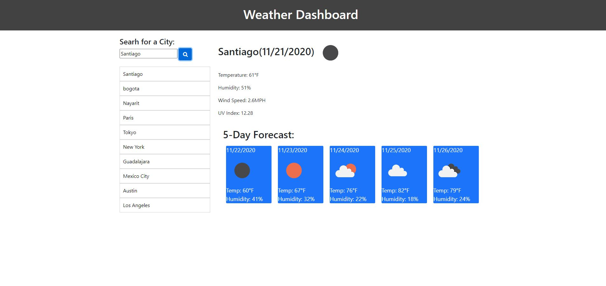

# 06 Server-Side APIs: Weather Dashboard

## Description

The Weather Dashboard gives the user access to search for any city and obtain the temperature, humidity, wind speed and UV index in real time. The Weather Dashboard also displays the next 5 forecast days.
This application also stores the users searched citys on the left column, with the most recent searched city on top. 

## Mock-Up

## Live Link
https://jannverduzco.github.io/06-server-side-apis-weather-dashboard/

## Repository Link
https://github.com/jannverduzco/06-server-side-apis-weather-dashboard